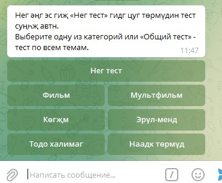
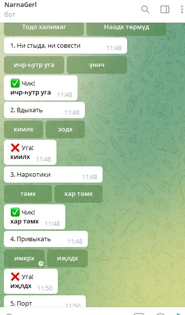
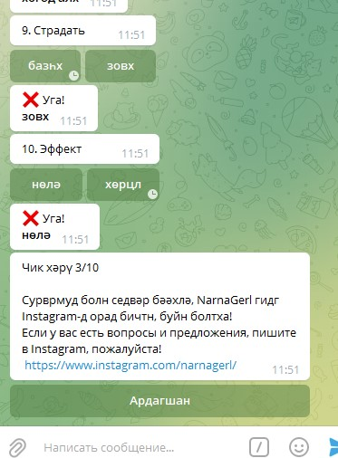

## Telegram quiz for learning the Kalmyk language

##### Technologies used:

- Maven
- Spring Boot
- MongoDB

#### How to build project:

##### To build you need *Maven 3.3.9* or higher

command for build: 
```yaml
mvn package
```
or if you need to delete the `target` folder:
```yaml
mvn clean package
```
If during assembly you need to skip unit tests, then you need to add `-DskipTests`

#### Application screenshots:

##### Start Quiz:
###### first you have to choose a topic for the quiz (general for all or for sections)


##### Quiz process:
###### as you can see in the screenshot, you are prompted to choose the correct translation option


##### Final:
###### at the end of the quiz, the number of correct answers is displayed


##### Link to the bot where you can test quiz:
https://t.me/narnagerl_bot